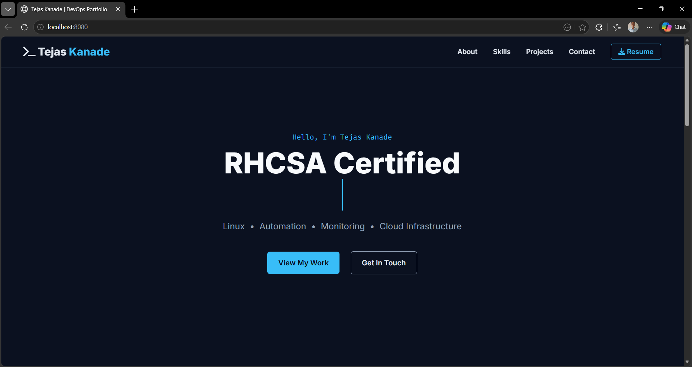
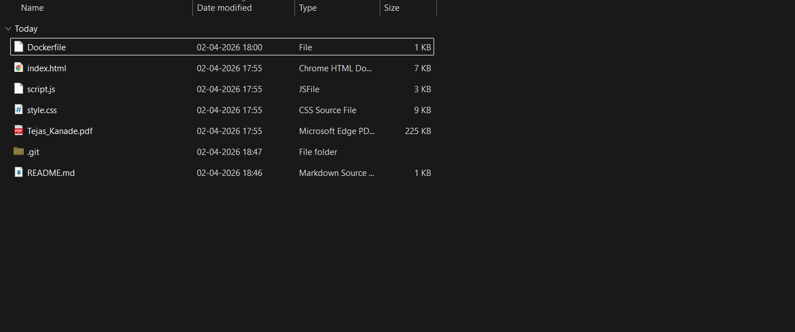
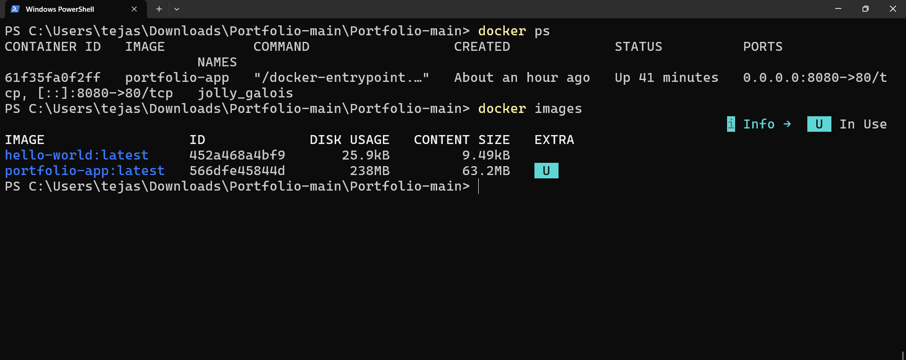

<<<<<<< HEAD
<<<<<<< HEAD
# Tejas Kanade - DevOps & Cloud Portfolio
=======
# 🚀 Dockerized Portfolio Website
>>>>>>> aa1d78399410e27a85590ba9c1b0e928dcff6692

## 📌 Project Description

This project demonstrates containerization and deployment of a personal portfolio website using Docker and Nginx.

The website is packaged inside a Docker container and served using an Nginx web server, ensuring consistent performance across different environments.

This project showcases core DevOps concepts such as containerization, deployment, container lifecycle management, and basic monitoring.

<<<<<<< HEAD
## 📂 Features
- Projects showcase
- Certifications section
- Skills overview
- Contact information
=======
# CodeAlpha_PortfolioDocker
>>>>>>> b361641a388650d83ef48bdeee5b34852f026142
=======
---

## ⚙️ Technologies Used

- HTML, CSS, JavaScript
- Docker
- Nginx

---

## 🚀 How to Run

1. Clone the repository:
   git clone https://github.com/tejaskanade15/CodeAlpha_PortfolioDocker.git

2. Navigate to the project folder:
   cd CodeAlpha_PortfolioDocker

3. Build the Docker image:
   docker build -t portfolio-app .

4. Run the container:
   docker run -d -p 8080:80 portfolio-app

5. Open in browser:
   http://localhost:8080

---

## 🐳 Dockerfile Explanation

- FROM nginx:latest  
  → Uses Nginx as the base web server  

- COPY . /usr/share/nginx/html  
  → Copies all website files into the server directory  

---

## 🛠️ Docker Commands Used

- docker build -t portfolio-app .
- docker run -d -p 8080:80 portfolio-app
- docker ps
- docker images
- docker stop <container_id>
- docker start <container_id>
- docker logs <container_id>

---

## 💡 Features

- Responsive portfolio website
- Containerized using Docker
- Deployed using Nginx web server
- Portable and runs on any system with Docker installed

---

## 📸 Screenshots

### 🌐 Website Running

### 📁 Project Structure

### 🐳 Docker Container & Images

---

## 👨‍💻 Author

Tejas Kanade
>>>>>>> aa1d78399410e27a85590ba9c1b0e928dcff6692
